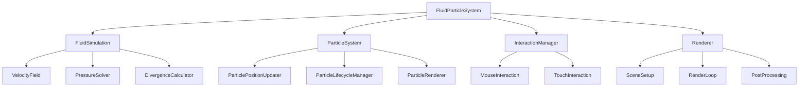

# 流体力学パーティクルシステムのアーキテクチャ

## 技術スタック

流体力学パーティクルシステムの実装には以下の技術スタックを使用します：

- **Deno**: TypeScriptネイティブのJavaScriptランタイム
- **TypeScript**: 型安全なJavaScriptのスーパーセット
- **Three.js**: 3Dレンダリングライブラリ
- **GPUComputationRenderer**: Three.jsのGPUベース計算用ユーティリティ
- **WebGL2**: 高度なグラフィックス機能のためのAPI
- **GLSL**: シェーダープログラミング言語

Denoを使用することで、TypeScriptのネイティブサポート、セキュリティ重視のパーミッションモデル、モダンなJavaScript APIの利用が可能になります。Three.jsを使用することで、WebGLの低レベルな実装の複雑さを抽象化し、より保守性の高いコードを実現します。GPUComputationRendererは流体シミュレーションやパーティクル位置の更新などの計算処理をGPU上で効率的に実行するために使用します。

## システムアーキテクチャ

システム全体は以下のコンポーネントで構成されます：



### コンポーネントの役割

#### FluidParticleSystem
メインクラスとして全体を統括し、他のコンポーネント間の連携を管理します。アニメーションループを制御し、ウィンドウのリサイズイベントなども処理します。

#### FluidSimulation
流体シミュレーションを担当するコンポーネントです。以下のサブコンポーネントで構成されます：
- **VelocityField**: 速度場の計算と更新
- **PressureSolver**: 圧力の計算（ポアソン方程式の解法）
- **DivergenceCalculator**: 速度場の発散の計算

#### ParticleSystem
パーティクルの管理と描画を担当するコンポーネントです。以下のサブコンポーネントで構成されます：
- **ParticlePositionUpdater**: パーティクルの位置更新
- **ParticleLifecycleManager**: パーティクルの寿命管理
- **ParticleRenderer**: パーティクルの描画

#### InteractionManager
ユーザー入力の処理を担当するコンポーネントです。以下のサブコンポーネントで構成されます：
- **MouseInteraction**: マウスイベントの処理
- **TouchInteraction**: タッチイベントの処理

#### Renderer
Three.jsのレンダリング機能を管理するコンポーネントです。以下のサブコンポーネントで構成されます：
- **SceneSetup**: シーンとカメラのセットアップ
- **RenderLoop**: レンダリングループの管理
- **PostProcessing**: ポストプロセッシングエフェクト（オプション）

## データフロー

システム内のデータフローは以下の通りです：

1. **ユーザー入力**: InteractionManagerがマウスやタッチの入力を検出
2. **流体シミュレーション**: ユーザー入力に基づいて流体の速度場を更新
3. **パーティクル更新**: 流体の速度場に基づいてパーティクルの位置を更新
4. **レンダリング**: 更新されたパーティクルをレンダリング

このデータフローはアニメーションフレームごとに繰り返されます。

## Denoでの実装アーキテクチャ

Denoを使用した実装では、以下のアーキテクチャを採用します：

### モジュール構造

```
fluid-particles-app/
├── deno.json                  # Deno設定ファイル
├── import_map.json            # インポートマップ
├── main.ts                    # エントリーポイント
├── simulation/
│   ├── FluidSimulation.ts     # 流体シミュレーションクラス
│   ├── ParticleSystem.ts      # パーティクルシステムクラス
│   ├── InteractionManager.ts  # インタラクション管理クラス
│   └── FluidParticleSystem.ts # メインクラス
├── shaders/
│   ├── velocity.frag          # 速度更新シェーダー
│   ├── pressure.frag          # 圧力計算シェーダー
│   ├── divergence.frag        # 発散計算シェーダー
│   ├── particle.vert          # パーティクル頂点シェーダー
│   ├── particle.frag          # パーティクル断片シェーダー
│   └── ...
├── utils/
│   ├── deviceDetection.ts     # デバイス検出ユーティリティ
│   ├── performanceMonitor.ts  # パフォーマンス監視
│   └── ...
└── static/
    ├── index.html             # HTMLエントリーポイント
    └── ...
```

### 依存関係の管理

Denoでは、`import_map.json`を使用して依存関係を管理します：

```json
{
  "imports": {
    "three": "npm:three@0.150.0",
    "@types/three": "npm:@types/three@0.150.0",
    "three/examples/jsm/misc/GPUComputationRenderer": "npm:three@0.150.0/examples/jsm/misc/GPUComputationRenderer.js"
  }
}
```

### シェーダーの読み込み

Denoでは、シェーダーファイルを直接読み込むことができます：

```typescript
// シェーダーの読み込み
const velocityShader = await Deno.readTextFile("./shaders/velocity.frag");
const pressureShader = await Deno.readTextFile("./shaders/pressure.frag");
const divergenceShader = await Deno.readTextFile("./shaders/divergence.frag");
```

### サーバーの実装

静的ファイルを提供するためのシンプルなサーバーを実装します：

```typescript
import { serve } from "https://deno.land/std@0.177.0/http/server.ts";
import { serveDir } from "https://deno.land/std@0.177.0/http/file_server.ts";

serve((req) => {
  return serveDir(req, {
    fsRoot: "static",
  });
}, { port: 8000 });
```

## プロジェクト構造

```
fluid-particles-app/
├── deno.json                  # Deno設定ファイル
├── import_map.json            # インポートマップ
├── main.ts                    # エントリーポイント
├── server.ts                  # 静的ファイルサーバー
├── simulation/
│   ├── FluidSimulation.ts     # 流体シミュレーションクラス
│   ├── ParticleSystem.ts      # パーティクルシステムクラス
│   ├── InteractionManager.ts  # インタラクション管理クラス
│   └── FluidParticleSystem.ts # メインクラス
├── shaders/
│   ├── velocity.frag          # 速度更新シェーダー
│   ├── pressure.frag          # 圧力計算シェーダー
│   ├── divergence.frag        # 発散計算シェーダー
│   ├── particle.vert          # パーティクル頂点シェーダー
│   ├── particle.frag          # パーティクル断片シェーダー
│   └── ...
├── utils/
│   ├── deviceDetection.ts     # デバイス検出ユーティリティ
│   ├── performanceMonitor.ts  # パフォーマンス監視
│   └── ...
└── static/
    ├── index.html             # HTMLエントリーポイント
    ├── styles.css             # スタイルシート
    └── bundle.js              # バンドルされたJavaScript
```

このドキュメントは元の仕様書から分割されたものです。概要と元の実装の分析については `fluid-particles-overview.md` を、技術的な課題と解決策については `fluid-particles-technical-challenges.md` を参照してください。実装の詳細は `tasks/` ディレクトリ内の各ファイルに記載されています。
## システムアーキテクチャ

システム全体は以下のコンポーネントで構成されます：


### コンポーネントの役割

#### FluidParticleSystem
メインクラスとして全体を統括し、他のコンポーネント間の連携を管理します。アニメーションループを制御し、ウィンドウのリサイズイベントなども処理します。

#### FluidSimulation
流体シミュレーションを担当するコンポーネントです。以下のサブコンポーネントで構成されます：
- **VelocityField**: 速度場の計算と更新
- **PressureSolver**: 圧力の計算（ポアソン方程式の解法）
- **DivergenceCalculator**: 速度場の発散の計算

#### ParticleSystem
パーティクルの管理と描画を担当するコンポーネントです。以下のサブコンポーネントで構成されます：
- **ParticlePositionUpdater**: パーティクルの位置更新
- **ParticleLifecycleManager**: パーティクルの寿命管理
- **ParticleRenderer**: パーティクルの描画

#### InteractionManager
ユーザー入力の処理を担当するコンポーネントです。以下のサブコンポーネントで構成されます：
- **MouseInteraction**: マウスイベントの処理
- **TouchInteraction**: タッチイベントの処理

#### Renderer
Three.jsのレンダリング機能を管理するコンポーネントです。以下のサブコンポーネントで構成されます：
- **SceneSetup**: シーンとカメラのセットアップ
- **RenderLoop**: レンダリングループの管理
- **PostProcessing**: ポストプロセッシングエフェクト（オプション）

## データフロー

システム内のデータフローは以下の通りです：

1. **ユーザー入力**: InteractionManagerがマウスやタッチの入力を検出
2. **流体シミュレーション**: ユーザー入力に基づいて流体の速度場を更新
3. **パーティクル更新**: 流体の速度場に基づいてパーティクルの位置を更新
4. **レンダリング**: 更新されたパーティクルをレンダリング

このデータフローはアニメーションフレームごとに繰り返されます。

## Denoでの実装アーキテクチャ

Denoを使用した実装では、以下のアーキテクチャを採用します：

### モジュール構造

```
fluid-particles-app/
├── deno.json                  # Deno設定ファイル
├── import_map.json            # インポートマップ
├── main.ts                    # エントリーポイント
├── simulation/
│   ├── FluidSimulation.ts     # 流体シミュレーションクラス
│   ├── ParticleSystem.ts      # パーティクルシステムクラス
│   ├── InteractionManager.ts  # インタラクション管理クラス
│   └── FluidParticleSystem.ts # メインクラス
├── shaders/
│   ├── velocity.frag          # 速度更新シェーダー
│   ├── pressure.frag          # 圧力計算シェーダー
│   ├── divergence.frag        # 発散計算シェーダー
│   ├── particle.vert          # パーティクル頂点シェーダー
│   ├── particle.frag          # パーティクル断片シェーダー
│   └── ...
├── utils/
│   ├── deviceDetection.ts     # デバイス検出ユーティリティ
│   ├── performanceMonitor.ts  # パフォーマンス監視
│   └── ...
└── static/
    ├── index.html             # HTMLエントリーポイント
    └── ...
```

### 依存関係の管理

Denoでは、`import_map.json`を使用して依存関係を管理します：

```json
{
  "imports": {
    "three": "npm:three@0.150.0",
    "@types/three": "npm:@types/three@0.150.0",
    "three/examples/jsm/misc/GPUComputationRenderer": "npm:three@0.150.0/examples/jsm/misc/GPUComputationRenderer.js"
  }
}
```

### シェーダーの読み込み

Denoでは、シェーダーファイルを直接読み込むことができます：

```typescript
// シェーダーの読み込み
const velocityShader = await Deno.readTextFile("./shaders/velocity.frag");
const pressureShader = await Deno.readTextFile("./shaders/pressure.frag");
const divergenceShader = await Deno.readTextFile("./shaders/divergence.frag");
```

### サーバーの実装

静的ファイルを提供するためのシンプルなサーバーを実装します：

```typescript
import { serve } from "https://deno.land/std@0.177.0/http/server.ts";
import { serveDir } from "https://deno.land/std@0.177.0/http/file_server.ts";

serve((req) => {
  return serveDir(req, {
    fsRoot: "static",
  });
}, { port: 8000 });
```

## プロジェクト構造

```
fluid-particles-app/
├── deno.json                  # Deno設定ファイル
├── import_map.json            # インポートマップ
├── main.ts                    # エントリーポイント
├── server.ts                  # 静的ファイルサーバー
├── simulation/
│   ├── FluidSimulation.ts     # 流体シミュレーションクラス
│   ├── ParticleSystem.ts      # パーティクルシステムクラス
│   ├── InteractionManager.ts  # インタラクション管理クラス
│   └── FluidParticleSystem.ts # メインクラス
├── shaders/
│   ├── velocity.frag          # 速度更新シェーダー
│   ├── pressure.frag          # 圧力計算シェーダー
│   ├── divergence.frag        # 発散計算シェーダー
│   ├── particle.vert          # パーティクル頂点シェーダー
│   ├── particle.frag          # パーティクル断片シェーダー
│   └── ...
├── utils/
│   ├── deviceDetection.ts     # デバイス検出ユーティリティ
│   ├── performanceMonitor.ts  # パフォーマンス監視
│   └── ...
└── static/
    ├── index.html             # HTMLエントリーポイント
    ├── styles.css             # スタイルシート
    └── bundle.js              # バンドルされたJavaScript
```

このドキュメントは元の仕様書から分割されたものです。概要と元の実装の分析については `fluid-particles-overview.md` を、技術的な課題と解決策については `fluid-particles-technical-challenges.md` を参照してください。実装の詳細は `tasks/` ディレクトリ内の各ファイルに記載されています。
