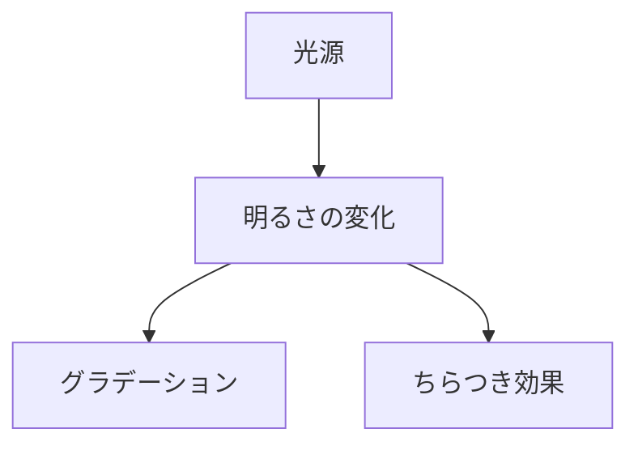
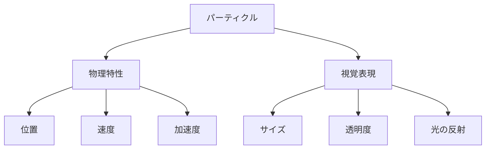
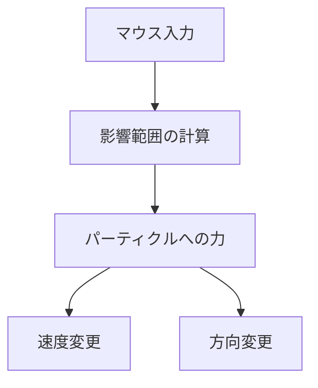

# ちらちらと光が差し込む中で舞うチリのインタラクション

## 概要

p5.jsを使用して、光が差し込む空間でチリが舞うインタラクティブなアニメーションを作成する。
マウスの動きに反応してチリが攪拌される効果を実装する。

## 技術仕様

### 1. 光の表現



- 画面上部から差し込む光を表現
  - グラデーションで光のボリュームを表現
  - 時間経過で明るさが微妙に変化
  - ランダムな揺らぎでちらつきを表現

### 2. チリ・埃の表現



- パーティクルシステムを使用
  - 複数のサイズのチリを生成
  - 各パーティクルは以下のプロパティを持つ:
    - 位置 (x, y)
    - 速度 (vx, vy)
    - 加速度 (ax, ay)
    - サイズ (size)
    - 透明度 (alpha)
  - 光に当たる位置での反射効果
    - 光が強い領域では透明度を上げる
    - 反射光の表現を追加

### 3. マウスインタラクション



- マウスの動きに応じたパーティクルの挙動
  - マウスの移動速度に応じた影響力の計算
  - マウスからの距離に応じた力の減衰
  - 渦を巻くような動きの表現

### 実装パラメータ

```javascript
const CONFIG = {
  // パーティクル設定
  NUM_PARTICLES: 200,
  MIN_SIZE: 1,
  MAX_SIZE: 3,
  
  // 物理パラメータ
  GRAVITY: 0.02,
  FRICTION: 0.99,
  
  // 光の設定
  LIGHT_FLICKER_SPEED: 0.05,
  LIGHT_INTENSITY_MIN: 0.7,
  LIGHT_INTENSITY_MAX: 1.0,
  
  // マウスインタラクション
  MOUSE_INFLUENCE_RADIUS: 100,
  MOUSE_FORCE: 0.5
};
```

## アニメーションの流れ

1. セットアップ
   - キャンバスの作成
   - パーティクルの初期化
   - 光源の初期化

2. メインループ
   - 光の更新
     - 強度の計算
     - グラデーションの更新
   - パーティクルの更新
     - 物理演算の適用
     - マウスの影響の計算
     - 位置の更新
   - 描画
     - 背景（光）の描画
     - パーティクルの描画

## 拡張可能性

- 複数の光源対応
- 風の効果の追加
- パーティクルの色変化
- 3D表現への拡張